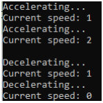

## Vehicle Class

### Instructions:
 
- Create a class that represents a Vehicle. The class should contain the following:
  - An attribute for the current speed of the vehicle.
  - All attributes should be private to the class.
  - The class should contain an init method (constructor) that sets the vehicle’s speed to 0.
  - Create an accelerate method that adds 1 to the vehicle’s speed. 
  - Create a decelerate method that subtracts 1 from the vehicle’s speed. 
  - Create a display_speed method that prints the vehicle’s current speed. 
  - Create a program that does the following:
    - uses the Vehicle class to create a vehicle object and then:
    - accelerate the vehicle twice 
      - display the current speed after each acceleration 
    - decelerate the vehicle twice 
      - display the current speed after each deceleration. 
- Enter your name, the lab number, and the current date into a set of comments at the top of the code.	
- Push the program source code to the assignment repo. 

### Example Output

### Grading:
- General, compiles, comments, proper indentation, etc  
- General class definition  
- Class attribute creation  
- init method  
- accelerate/decelerate/display_speed methods  
- Object creation and use 